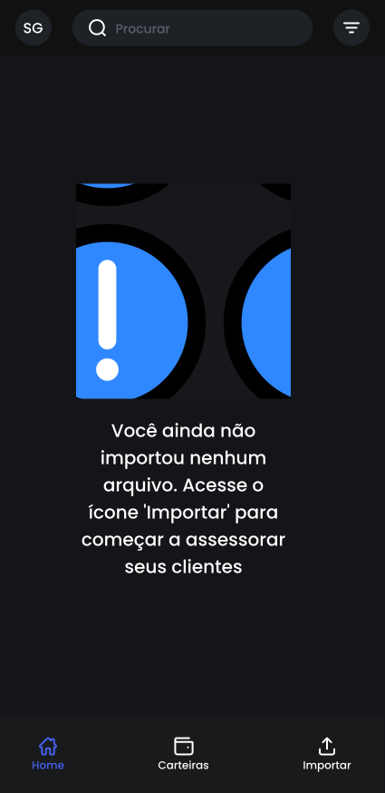
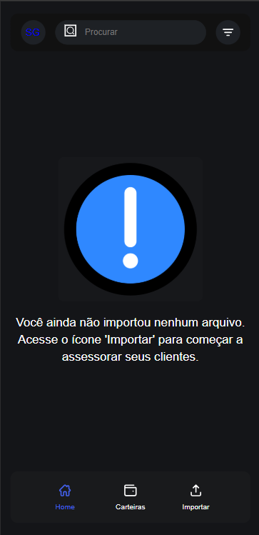

# POND-UX1-ES02

Este repositório refere-se à atividade ponderada intitulada *"Atividade de UX: Figma"*, desenvolvida durante o segundo módulo do curso de Engenharia de Software. O objetivo principal da atividade era projetar um componente de interface para um aplicativo mobile utilizando o Figma, e posteriormente implementá-lo, garantindo consistência entre o design e a versão funcional.

O desafio envolvia seguir diretrizes específicas, como o uso do *Auto Layout* e a utilização do *Dev Mode* para facilitar a transição entre o protótipo visual e o código funcional.

# Processo de Desenvolvimento

A atividade foi desenvolvida em etapas bem definidas. Primeiramente, foi criado o projeto inicial no Figma, onde foram desenvolvidos três componentes principais: a *navbar superior, o **componente de aviso* e a *bottom navbar. A **navbar superior* contém um atalho rápido para a área logada do assessor, uma barra de pesquisa funcional e também um ícone que permite ao usuário acessar filtros relevantes. O *componente de aviso* tem como função alertar o usuário caso ele ainda não tenha realizado nenhum upload das carteiras, o incentivando a importar seus dados por meio de um ícone destacado e um texto explicativo. Já a *bottom navbar* oferece navegação intuitiva entre as páginas principais do app: *Home, **Carteiras* e *Importar*. A página Home apresenta insights gerais sobre as carteiras disponíveis, enquanto a página Carteiras permite uma análise individual de cada uma delas. A página Importar é responsável por permitir que o assessor realize o upload dos documentos necessários.

Após finalizar o layout mais básico, os elementos foram agrupados e as camadas nomeadas de forma clara e descritiva, substituindo nomes genéricos como “Rectangle” por identificadores mais significativos, como “Background-Searchbar”. Essa organização ajudou na compreensão do design tanto durante a própria construção quanto na etapa seguinte: a codificação. Para essa parte, utilizamos o *Dev Mode do Figma*, que nos forneceu informações precisas sobre dimensões, espaçamentos e estilos, facilitando a reprodução fiel do layout no ambiente web. Isso garantiu que o processo de transformar o design em código fosse mais eficiente e menos propenso a erros.

# Codificação e Estrutura Final

Durante a implementação em HTML e CSS, buscamos manter o código limpo, organizado e com comentários objetivos, visando facilitar a leitura. Além disso, seguimos boas práticas de desenvolvimento front-end, como o uso de classes semânticas, responsividade e remoção de outlines indesejáveis em elementos interativos, como botões e links.

O resultado final é uma tela funcional, com todos os elementos posicionados conforme o design original no Figma, e com comportamento responsivo. Cada componente foi testado individualmente para garantir sua funcionalidade e estilo visual adequado.

# Uso do Auto Layout

Aplicamos também o *Auto Layout no Figma*, garantindo que os componentes se mantivessem visualmente consistentes mesmo quando redimensionados. Definimos tamanhos mínimos para os elementos, evitando que ficassem distorcidos ou perdessem a funcionalidade em diferentes proporções. Esse recurso foi fundamental para validar a adaptação dos componentes em diversos contextos, simulando possíveis variações no futuro uso real do app.

Essa prática se mostrou essencial para a criação de interfaces escaláveis e profissionais, além de facilitar a comunicação entre designers e desenvolvedores, já que os componentes são mais previsíveis e fáceis de entender.

# Resultado Final

O resultado final pode ser conferido tanto no próprio Figma quanto na página HTML/CSS desenvolvida. O link para acesso ao projeto no Figma é este:  
[Clique aqui para acessar o Figma](https://www.figma.com/design/ivGD751Am6tWgkZAuWLzoG/Untitled?node-id=1-10&t=KD35xMGhq8eN4nCr-1)  

Já para visualizar a tela implementada, basta abrir o arquivo index.html no navegador, após garantir que todos os assets (imagens e SVGs) estejam corretamente inseridos na pasta assets.

Abaixo você pode comparar o design original feito no Figma com a versão implementada em HTML/CSS:

  <figure style="text-align: center; margin: 0;">
    
    <figcaption><strong>Design no Figma</strong></figcaption>
  </figure>

  <figure style="text-align: center; margin: 0;">
    
    <figcaption><strong>Tela Implementada</strong></figcaption>
  </figure>

Em conclusão, essa atividade atingiu as expectativas. Conseguimos entregar um resultado final que reflete com fidelidade o design criado no Figma, e todo o processo foi muito enriquecedor. A maior dificuldade encontrada foi trabalhar com o *Auto Layout* de maneira que os componentes ficassem responsivos e visualmente consistentes em diferentes proporções. No início, exigiu bastante atenção para acertar os alinhamentos e os tamanhos mínimos, mas com prática, conseguimos dominar melhor esse recurso.

Por outro lado, a parte de codificação foi mais simples do que imaginávamos. Graças ao *Dev Mode do Figma*, foi possível extrair diretamente as medidas e estilos usados no design, o que tornou a implementação mais rápida e precisa. Isso reforça a importância de ferramentas que integram design e desenvolvimento, facilitando a comunicação entre ambas as áreas.